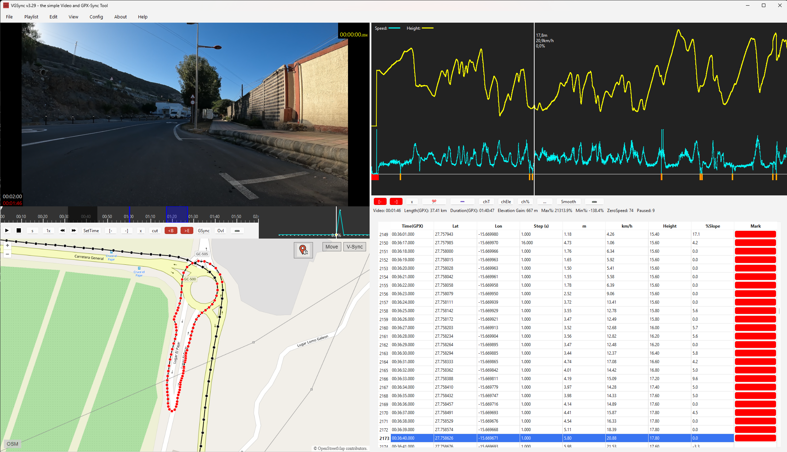

VGSync
======


VGSync is a Python-based desktop application designed to synchronize GPX data with video footage. Its a Video and GPX synchronising tool. It uses "mpv" for high-precision video playback and "ffmpeg" for media processing.



- Version: see Releases
- Platforms: Windows 64-bit (official support), Linux (tested on Kubuntu 24.04.2)
- License: GNU General Public License v3.0 or later (GPL-3.0-or-later)
- VGSync helps action cam users and outdoor enthusiasts to synchronize their recorded videos with GPS data for perfect route visualization and editing.
-------------------------------------------------------------------------------

Requirements
------------

- Python 3.10.9 (64-bit) or Python 3.12.0 (64-bit)
- mpv binary (must be placed in "mpv/" folder)
- ffmpeg binary (must be placed in "ffmpeg/" folder)

Note:
Binaries are NOT included in the Git repository due to size limitations.
You must manually download and extract them from the GitHub Releases page.

-------------------------------------------------------------------------------
## 🔧 Installation & Usage (Linux & Windows)

---

### 🐧 Linux

#### Requirements

Install the required system packages (one-time setup):

```bash
sudo apt update
sudo apt install ffmpeg libmpv-dev python3-venv
```

#### Download the Project

You can **either**:

- Download the latest ZIP from [GitHub Releases](https://github.com/ridewithoutstomach/VGSync/releases) and extract it  
**or**
- Clone the repository:

```bash
git clone https://github.com/ridewithoutstomach/VGSync.git
```

#### Setup and Run

```bash
cd VGSync
python3 -m venv venv
source venv/bin/activate
pip install -r requirements.txt
python VGSync.py
```

---

### 🪟 Windows


#### Setup and Run

Open **Command Prompt**, then:

```cmd
cd VGSync
python -m venv venv
venv\Scripts\activate
pip install -r requirements.txt
python VGSync.py
```

---

### ❗ Important Notes

- Always create and activate the virtual environment **inside** the `VGSync` folder.
- Do **not** run `python VGSync.py` outside the project folder.
- On **Linux**, make sure required packages like `ffmpeg` and `libmpv-dev` are installed.


-------------------------------------------------------------------------------

Install External Binaries (Windows)
--------------------------

Download the following ZIP files from the latest VGSync Release:

- ffmpeg.zip → extract into "ffmpeg/" folder
- mpv.zip → extract into "mpv/" folder

The "ffmpeg/" and "mpv/" folders include guidance files ("VGSync_ffmpeg.txt" and "VGSync_mpv.txt") describing the expected contents.

-------------------------------------------------------------------------------

Running the Application
------------------------

To start VGSync:

    python VGSync.py

Important for Linux users:
After launching the application, please enable "Use Software OpenGL" 
in the Config menu to ensure proper video playback.

-------------------------------------------------------------------------------

Windows Executable
------------------

If you prefer not to install Python or manage dependencies manually,
you can use the pre-built Windows binary:

1. Download the ZIP file (e.g., "VGSync_3.27_Win_x64.zip") from the GitHub Releases page.
2. Extract the ZIP file into any folder.
3. Double-click "VGSync.exe" to run the application.

-------------------------------------------------------------------------------

Building the Windows Executable Manually
----------------------------------------

To create your own Windows executable:

    python build_with_pyinstaller.py

The resulting executable will be located at:

    dist/VGSync_3.27/VGSync.exe

-------------------------------------------------------------------------------

Third-Party Components
-----------------------

This project includes and relies on the following third-party components:

FFmpeg
- Version: 7.1-full_build
- License: GPLv3
- Website: https://ffmpeg.org
- Binaries provided in: "ffmpeg/"
- Original source code included in: "third-party-src/FFmpeg-7.1-source.zip"
- Release notes included in the source archive

mpv
- Version: 0.40.0
- License: LGPLv2.1+
- Website: https://mpv.io
- Binaries provided in: "mpv/"
- Original source code included in: "third-party-src/mpv-0.40.0-source.zip"
- Release notes included in the source archive

All third-party components are redistributed in accordance with their respective licenses.
The complete and unmodified source code is included in the "third-party-src/" directory 
and will be retained and made available for at least three (3) years in accordance with GPL and LGPL requirements.

-------------------------------------------------------------------------------

License
-------

This project is licensed under the GNU General Public License v3.0 or later.

You are free to:
- Use, copy, and distribute this software
- Study and modify the source code
- Redistribute modified versions under the same license

The full text of the license is included in the "LICENSE" file.

-------------------------------------------------------------------------------

Contact
-------

For questions, suggestions, or contributions, please open an issue or pull request on GitHub.

-------------------------------------------------------------------------------
