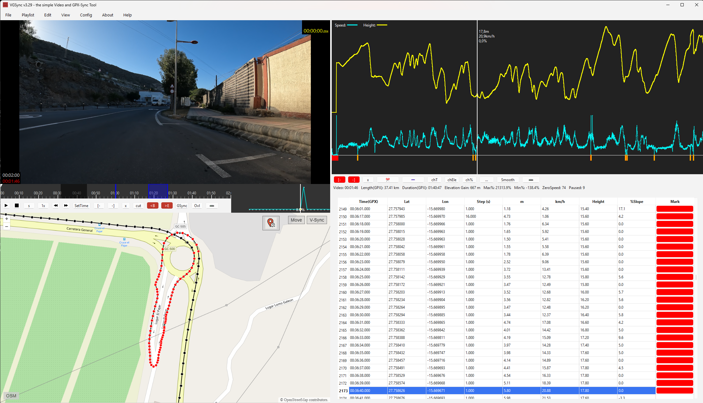

KVRouite
======

> **Note:** This project was **formerly known as [VGSync](https://github.com/ridewithoutstomach/VGSync)**.  
> The name was changed to better reflect the tool’s purpose — it’s much more than a sync utility:  
> a complete *Video and GPX Route Creation Suite*.


KVRouite is a Python-based desktop application designed to synchronize GPX data with video footage. Its a Video and GPX synchronising tool. It plays, cuts and renders video through "GStreamer Editing Services (GES)". Copy mode additionally needs "ffmpeg", which you install yourself - KVRouite does not ship it. Because preview and export build the same GES timeline, the preview shows what the export will produce - including the crossfades at your cuts and true 360°: equirectangular footage is reprojected to a normal picture, you pick the viewing direction and zoom in the preview by dragging and scrolling, and that view is what gets rendered.



- Version: see Releases
- Platforms: Windows 64-bit (official support, ready-made download), Linux (tested on Kubuntu 24.04.2), macOS 15+ on Apple Silicon and Intel (run from source with Python - no ready-made bundle in 7.0, see the macOS section)
- License: GNU General Public License v3.0 or later (GPL-3.0-or-later)
- KVRouite helps action cam users and outdoor enthusiasts to synchronize their recorded videos with GPS data for perfect route visualization and editing.
-------------------------------------------------------------------------------

Requirements
------------

- Python 3.12.10 or newer (64-bit), or Python 3.14.x (64-bit). Take the
  regular build, not the free-threaded "3.14t" one. Since 7.0 the voice
  remover pulls in PyTorch and friends, whose wheels exist for 3.12 to 3.14;
  3.10 is no longer supported. **Building** the executable needs at least
  3.12.1 - 3.12.0 has a bug (CPython issue 110543) that breaks scipy inside a
  PyInstaller build; the build scripts refuse it.
- ffmpeg and ffprobe in your PATH - **only** for the Copy-Mode. They are not
  shipped with KVRouite; without them Copy-Mode stays disabled and everything
  else works.

There are three requirements files:

- "requirements.txt" - everything the application needs to run, GStreamer
  included. On Windows and macOS one command installs all of it. On Linux the
  GStreamer line is skipped automatically, because there are no Linux wheels -
  there it comes from the distribution, see below.
- "requirements-voice.txt" - optional: the voice remover (since 7.0), that is
  python-audio-separator with PyTorch, ONNX Runtime and the rest, about
  750 MB. Without it KVRouite is the Lite application: it runs completely,
  sound track and traffic damper included; only "Remove voices" and the
  voice detection are locked. Run pip from the project directory - two lines
  in it point at small stand-in packages inside the project
  (tools/diffq_platzhalter), which the library would otherwise pull from PyPI
  under a non-commercial license.
- "requirements-build.txt" - additional packages needed only to build the
  Windows executable (PyInstaller and its dependencies).

The Windows download comes in the same two parts: "KVRouite_<ver>_Win_x64"
(the application, "Lite" - with sound track and traffic damper) and
"KVRouite_<ver>_Voice_Win_x64" (the voice remover and its detection; about
900 MB). The Voice zip carries the same folder name and is simply unpacked
over the KVRouite folder; the Voice installer does the same into an existing
installation of the same version. There is no ready-made macOS download in
7.0 - on macOS you install Python and run from source (see the macOS section).

In short: to run KVRouite, install "requirements.txt". To also remove
voices, install "requirements-voice.txt" on top. To build the executable,
install "requirements-build.txt" as well. Each platform section below shows
the exact commands.

-------------------------------------------------------------------------------
## 🔧 Installation & Usage (Linux, Windows & macOS)

### No signed binaries - and what your alternatives are

**This applies to the Windows download.** It is not signed, so Windows questions
it the first time you start it: SmartScreen warns about an unknown publisher.
macOS ships no ready-made download in 7.0 - there you install Python and run
from source (see the macOS section), so there is nothing to click past.

The reason is the only one there is: signing costs money every year - Windows
needs a code-signing certificate, renewed annually. **KVRouite is a non-profit
hobby project, given away for free, and I am not going to buy a licence in order
to hand it out.** There is nothing hidden behind that.

**Nobody has to click past those warnings.** They are an offer, not a
requirement, and if you would rather not - a perfectly reasonable position -
there are two other ways, both fully supported:

- **Run from source.** Download the source code, follow the instructions for
  your platform below, and start KVRouite with Python. Nothing is signed there
  either, but nothing is opaque: you run the files you can read. This is the
  only route on Linux anyway, and it is a first-class one - it is what
  development happens on.
- **Check the code before you run it.** The whole source is in this repository.
  Read it, or have an AI read it for you and say whether it does anything it
  should not. That takes minutes today, and it works just as well for the
  packages listed in `requirements.txt`. Nothing here is obfuscated, minified or
  precompiled - what you see is what runs.

---

### 🐧 Linux

#### Requirements

Install the required system packages (one-time setup):

```bash
sudo apt update
sudo apt install ffmpeg python3-venv
```

#### Required: GStreamer / GES

KVRouite plays, cuts and renders the timeline through GStreamer Editing
Services. This is not optional -- without it the application will not start.

On Linux there are no GStreamer Python wheels, so this comes from the
distribution:

```bash
sudo apt install python3-gi python3-gi-cairo \
    gir1.2-gstreamer-1.0 gir1.2-gst-plugins-base-1.0 gir1.2-ges-1.0 \
    gstreamer1.0-plugins-base gstreamer1.0-plugins-good \
    gstreamer1.0-plugins-bad gstreamer1.0-plugins-ugly \
    gstreamer1.0-libav gstreamer1.0-gl gstreamer1.0-x
```

`gir1.2-ges-1.0` is in the *universe* component; if apt cannot find it,
enable it once with `sudo add-apt-repository universe`. Ubuntu 24.04 LTS
ships GStreamer 1.24.2, Ubuntu 26.04 LTS ships 1.28.2; the Windows build
uses the 1.28.6 wheels (see `requirements.txt`).

These are **system** packages. A plain venv hides them and `import gi`
fails although everything is installed -- create the venv with
`--system-site-packages` as shown below.

Then verify the environment before starting the app:

```bash
python3 check_ges.py
```

It checks typelibs, the GES engine, a usable video sink, an H.264 decoder and
the GL elements the 360 view needs, and it names the missing package instead
of failing later inside the player. A missing ffmpeg is reported as a hint,
not an error - it only costs you the Copy-Mode.

A step-by-step guide with a troubleshooting table is in
[`GES_Installation_Kubuntu.md`](GES_Installation_Kubuntu.md) (German).

#### Download the Project

You can **either**:

- Download the latest ZIP from [GitHub Releases](https://github.com/ridewithoutstomach/KVRouite/releases) and extract it  
**or**
- Clone the repository:

```bash
git clone https://github.com/ridewithoutstomach/KVRouite.git
```

#### Setup and Run

```bash
cd KVRouite
# --system-site-packages is mandatory on Linux: python3-gi and the GStreamer
# typelibs are system packages, and a plain venv hides them - "import gi"
# then fails although everything is installed, and the app will not start.
python3 -m venv --system-site-packages venv
source venv/bin/activate
# Python 3.12 removed distutils from its standard library. fitparse still
# needs it while being installed, and setuptools provides the replacement -
# so install it before the requirements.
pip install --upgrade pip setuptools
pip install -r requirements.txt
python KVRouite.py
```

The first start takes a while (GStreamer scans its plugins once, see
"Important Notes"); later starts are quick.

That is the Lite application, sound track and traffic damper included. For
the voice remover add its packages, once, in the same venv - about 750 MB
(the file points pip at PyTorch's CPU build, so no CUDA download):

```bash
pip install -r requirements-voice.txt
```

---

### 🪟 Windows

The ready-made builds from the
[Releases page](https://github.com/ridewithoutstomach/KVRouite/releases)
are not signed, so SmartScreen warns about an unknown publisher on the first
start: **More info > Run anyway**. Why that is, and what you can do instead,
is at the top of this chapter:
[No signed binaries](#no-signed-binaries---and-what-your-alternatives-are).
The instructions below are that other way - running from source.

#### Setup and Run

Open **Command Prompt**, then:

```cmd
cd KVRouite
python -m venv venv
venv\Scripts\activate
# Python 3.12 removed distutils from its standard library. fitparse still
# needs it while being installed, and setuptools provides the replacement -
# so install it before the requirements.
pip install --upgrade pip setuptools
pip install -r requirements.txt
python KVRouite.py
```

The first start takes a while (GStreamer scans its plugins once, see
"Important Notes"); later starts are quick.

That is the Lite application, sound track and traffic damper included. For
the voice remover add its packages, once, in the same venv - about 750 MB:

```cmd
pip install -r requirements-voice.txt
```

---

#### GStreamer / GES

On Windows the whole GStreamer runtime comes as pip wheels - no MSYS2, no
system installation. It is part of `requirements.txt`, so the install above
already covers it: `gstreamer-bundle` 1.28.6, ~80 MB in site-packages,
uninstalling removes every file. Check the result with `python check_ges.py`.

Licensing note: these wheels contain GPL- and LGPL-licensed binaries, among
them the x264/x265 encoder plugins that the GES encoder renders with. **If you
build and redistribute a Windows executable yourself, you are redistributing
those binaries** and the obligations in `gstreamer/NOTICE.txt` apply to you.
In practice that means shipping the license texts and keeping the directions to
the sources next to them - not hosting sources yourself, since the binaries are
the GStreamer Project's own and their sources are published by that project
(see `gstreamer/CORRESPONDING-SOURCE.txt`). `build_with_pyinstaller.py` copies
`gstreamer/` into the build for you and prints whether the GStreamer runtime
actually ended up in it.

---

### 🍎 macOS

On macOS you **install Python and run from source** - there is **no
ready-made macOS download in 7.0**. Earlier versions had an experimental
application bundle; 7.0 no longer ships one, because it adds a packaging
layer that is hard to test without a Mac of my own, and I do not have one.
The source path is the one that gets tested on GitHub's macOS machines
(Apple Silicon and Intel, macOS 15 and 26), and it has nothing in between
you and the program: no packaging, no code signing, no Gatekeeper. See
*Requirements* and *Setup and Run* below; it needs **macOS 15 or newer**.

#### Requirements

- **macOS 15 (Sequoia) or newer.** This is a hard limit, and not an obvious
  one. The PySide6 6.11 wheels are *labelled* `macosx_13_0`, but the libraries
  inside them are built for macOS 15 - among them `QtGui`, `QtWidgets` and
  `libshiboken6`. On macOS 13 or 14 the `pip install` therefore succeeds and
  the application still refuses to start, because macOS will not load those
  libraries. Measured on 2026-09-04: 18 of these library files declare a
  minimum of macOS 15.0, on both architectures.
- **Python 3.12.10 or newer, or 3.14.x (64-bit)** from
  [python.org](https://www.python.org/downloads/macos/) - take the *macOS
  64-bit universal2 installer*. Neither Homebrew nor pyenv is needed.
- Apple Silicon and Intel are both supported; the wheels are universal2.

#### Setup and Run

Open **Terminal**, then:

```bash
cd KVRouite
python3.12 -m venv venv
source venv/bin/activate
# Python 3.12 removed distutils from its standard library. fitparse still
# needs it while being installed, and setuptools provides the replacement -
# so install it before the requirements.
pip install --upgrade pip setuptools
pip install -r requirements.txt
python KVRouite.py
```

The first start takes a while (GStreamer scans its plugins once, see
"Important Notes"); later starts are quick.

That is the Lite application, sound track and traffic damper included. For
the voice remover add its packages, once, in the same venv - about 750 MB:

```bash
pip install -r requirements-voice.txt
```

The only difference from the Windows instructions above is the activation line:
`source venv/bin/activate` instead of `venv\Scripts\activate`.

#### GStreamer / GES

As on Windows, the whole GStreamer runtime comes as pip wheels - no Homebrew,
no GStreamer installer, nothing to install system-wide. It is part of
`requirements.txt`, so the install above already covers it: `gstreamer-bundle`
1.28.6, roughly 200 MB downloaded. This is **unlike Linux**, where GStreamer
has to come from the distribution. Check the result with:

```bash
python check_ges.py
```

#### ffmpeg

Only needed for the Copy-Mode, exactly as on the other platforms. Without it
everything else works and Copy-Mode stays disabled. If you want it:

```bash
brew install ffmpeg
```

#### Feedback wanted

Please open an issue at
<https://github.com/ridewithoutstomach/KVRouite/issues> and tell us:

- your macOS version and whether the Mac is Apple Silicon or Intel
- whether the window opens and looks right
- whether a video opens, plays, cuts and exports
- any messages the Terminal printed - please paste the text

---

### ❗ Important Notes

- These first two apply to running from source. They do not apply to the
  Windows executable, which carries everything with it:
  - Always create and activate the virtual environment **inside** the `KVRouite` folder.
  - Do **not** run `python KVRouite.py` outside the project folder.
- **The first start takes noticeably longer** - a minute is normal on a slow
  disk. GStreamer scans all its plugins once and writes the list to a cache
  file (under the user's application data, folder "KVRouite"); every start
  after that reads the cache and is quick. The scan runs again after a fresh
  venv, after updating the GStreamer packages, and after a new version of the
  executable. Nothing is wrong while it runs - just wait for the window.
- On **Linux**, make sure the GStreamer packages listed above are installed. `ffmpeg` is optional and only needed for the Copy-Mode.
- On **macOS**, nothing has to be installed system-wide - `requirements.txt` brings GStreamer along, same as on Windows.
- On **macOS**, there is no ready-made download in 7.0 - install Python and run
  from source, see the macOS section.


-------------------------------------------------------------------------------

External Binaries (Windows and macOS)
------------------------------------

There is nothing to download and unpack.

GStreamer comes from `requirements.txt` (see above). The "gstreamer/" folder
in this repository contains no binaries - only the license texts, the component
list and the source code directions, which the build process copies next to the
runtime.

ffmpeg is optional and only needed for the Copy-Mode. Install it yourself and
make sure `ffmpeg` and `ffprobe` are in your PATH, or point KVRouite at them
under Config > FFmpeg > Set ffmpeg Path. Without them the Copy-Mode is greyed
out and KVRouite says so once at startup.

-------------------------------------------------------------------------------

Running the Application
------------------------

To start KVRouite:

    python KVRouite.py

Important for Linux users:
After launching the application, please enable "Use Software OpenGL" 
in the Config menu to ensure proper video playback.

-------------------------------------------------------------------------------

Windows Executable
------------------

If you prefer not to install Python or manage dependencies manually,
you can use the pre-built Windows binary:

1. Download the asset whose name ends in "_Win_x64.zip" from the GitHub Releases page.
2. Extract the ZIP file into any folder.
3. Double-click "KVRouite.exe" to run the application.

-------------------------------------------------------------------------------

macOS
-----

7.0 ships no ready-made macOS download. On macOS, install Python and run from
source - see [the macOS section](#-macos).

-------------------------------------------------------------------------------

Building the Windows Executable Manually
----------------------------------------

To create your own Windows executable, install the build packages on top of
the runtime ones. Building needs Python 3.12.1 or newer (3.12.0 has a bug
that breaks scipy inside a PyInstaller build), the voice remover's packages
(the build is made with them and then split), and its models, fetched once:

    pip install --upgrade pip setuptools
    pip install -r requirements.txt
    pip install -r requirements-voice.txt
    pip install -r requirements-build.txt
    python tools/modelle_holen.py
    python build_with_pyinstaller.py

The script builds the application twice - once without the voice remover,
only to learn which files belong to it, then in full - and splits the result
into "KVRouite_<ver>_Win_x64.zip" (Lite) and "KVRouite_<ver>_Voice_Win_x64.zip"
(the add-on, same folder name, unpacked over the first). With
"--build-installer" it also produces the two Inno Setup installers; the Voice
one installs into an existing KVRouite installation of the same version and
refuses any other.

The resulting executable will be located at:

    dist/KVRouite_<version>/KVRouite.exe

-------------------------------------------------------------------------------

Third-Party Components
-----------------------

This project includes and relies on the following third-party components:

FFmpeg
- Version: 7.1, as **shared libraries only** (libavcodec, libavformat,
  libavutil, libswresample, libswscale), inside the GStreamer wheels and used
  by the gst-libav plugin.
- License: LGPL-2.1-or-later. Covered by the GStreamer entry below - the
  Corresponding Source is the GStreamer Project's own, see
  "gstreamer/CORRESPONDING-SOURCE.txt".
- The ffmpeg and ffprobe **programs** are not distributed with KVRouite. Copy
  mode calls whatever is installed on the user's system.
- Website: https://ffmpeg.org

GStreamer / GStreamer Editing Services (GES)
- Version: 1.28.6 on Windows (pip package "gstreamer-bundle", see
  requirements.txt); on Linux whatever the distribution ships
- License: LGPL-2.1-or-later for GStreamer core, gst-plugins-base/good/bad,
  GES and PyGObject. The bundled x264 and x265 encoder plugins - which the GES
  encoder uses for rendering - and the a52dec/dtsdec/dvdread plugins are
  GPL-2.0-or-later. Further components are under MIT, BSD, Apache-2.0, MPL and
  other permissive licenses. The Microsoft Visual C++ runtime redistributables
  contained in the wheels are proprietary Microsoft components and are System
  Libraries in the sense of the GNU GPL.
- Website: https://gstreamer.freedesktop.org
- Binaries: **Windows and macOS.** They are installed by pip and are placed
  into the "_internal" folder of the Windows build and into
  "KVRouite.app/Contents/Frameworks" of the macOS bundle. This is the engine
  KVRouite plays, cuts and renders with, so it is always present in a build of
  either - both build scripts refuse to package one without it. **On Linux
  nothing of this is distributed with KVRouite** - GStreamer is installed from
  the distribution's own packages, so KVRouite redistributes no GStreamer
  binary there.
- Source code: the binaries are the GStreamer Project's own prebuilt wheels,
  passed on unchanged. KVRouite compiles nothing here, so there is no KVRouite
  build to publish - the Corresponding Source is the 1.28.6 release tarballs at
  https://gstreamer.freedesktop.org/src/ plus the project's cerbero build
  recipes. GPLv3 section 6(d) permits exactly this: source on a third-party
  server, with clear directions next to the binaries. Those directions, the
  individual tarball URLs and a fallback contact are in
  "gstreamer/CORRESPONDING-SOURCE.txt".
- Notice and per-package license list: "gstreamer/NOTICE.txt" and
  "gstreamer/COMPONENTS.txt" (in the Windows build: "_internal/gstreamer/";
  in the macOS bundle: "KVRouite.app/Contents/Resources/gstreamer/")
- Note: the GStreamer wheels contain an LGPL build of the FFmpeg libraries,
  used by the gst-libav plugin. That is the only FFmpeg KVRouite distributes.

Qt 6 / PySide6 / shiboken6
- Version: Qt 6.11.2, PySide6 / PySide6-Essentials / PySide6-Addons /
  shiboken6 6.11.2
- License: the packages declare "LGPL-3.0-only OR GPL-2.0-only OR
  GPL-3.0-only"; KVRouite relies on LGPL-3.0-only. That is compatible with
  KVRouite being GPL-3.0-or-later, because the LGPL version 3 permits
  conveying the covered work under the GPL version 3.
- Website: https://pyside.org
- Binaries: **Windows and macOS.** Installed by pip and placed into
  "_internal/PySide6" of the Windows build and into
  "KVRouite.app/Contents/Frameworks" of the macOS bundle - 122 Qt6 modules,
  the largest third-party part of the application. On Linux nothing of this is
  distributed with KVRouite. Qt WebEngine, used for the map, embeds a
  Chromium-derived engine (Chromium 140.0.7339.225) that carries 187 further
  projects of its own.
- Relinking: the Qt libraries are ordinary shared libraries - DLL files on
  Windows, .dylib files in "Contents/Frameworks" of the macOS bundle - and are
  not linked into the executable, so they can be replaced with a compatible
  build. That is what the LGPL requires.
- Source code: the binaries are the Qt Project's own, passed on unchanged, so
  the Corresponding Source is that project's own release - see
  "qt/CORRESPONDING-SOURCE.txt" for the exact locations.
- Notice and license texts: "qt/NOTICE.txt", "qt/COMPONENTS.txt",
  "qt/COPYING.LGPL-3", "qt/COPYING.GPL-3", and for the browser engine
  "qt/LICENSE.chromium" (3-clause BSD, reproduced unchanged) together with
  "qt/CHROMIUM-THIRD-PARTY.txt", The Qt Company's list of the projects inside
  it (in the Windows build: "_internal/qt/"; in the macOS bundle:
  "KVRouite.app/Contents/Resources/qt/")

OpenLayers, CPython, OpenSSL, Pillow, fitparse
- OpenLayers 7.3.0 (BSD-2-Clause) - the map library, shipped as "ol.js" and
  "ol.css" next to the executable, in the macOS bundle next to the program in
  "KVRouite.app/Contents/MacOS"
- CPython 3.12 or 3.14, whichever the build was made with - the Copyright
  dialog in the application shows the exact version (Python Software
  Foundation License), OpenSSL 3 (Apache-2.0),
  Pillow 12.3.0 (MIT-CMU), fitparse 1.2.0 (MIT)
- All permissive; none requires us to supply source code, but each requires
  its notice to travel with the binaries.
- Notice and license texts: "third-party-licenses/" (in the Windows build:
  "_internal/third-party-licenses/"; in the macOS bundle:
  "KVRouite.app/Contents/Resources/third-party-licenses/")

Voice remover (since 7.0)
- Library: python-audio-separator 0.47.0 (MIT, Andrew Beveridge) - the
  separation core of Ultimate Vocal Remover as a library. It brings in
  PyTorch 2.14.0 (BSD-3-Clause and others), ONNX Runtime 1.29.0 (MIT), NumPy,
  SciPy, scikit-learn, librosa, numba, llvmlite and about forty further Python
  packages under MIT, BSD, ISC, Apache-2.0 and MPL-2.0. The complete list with
  versions and declared licenses is "third-party-licenses/voice/INVENTAR.txt",
  the license texts are the "third-party-licenses/voice/LICENSE.<package>"
  files; both are generated from the build environment by
  "tools/lizenzen_sammeln.py".
- LGPL: two of those packages carry a library under LGPL-2.1-or-later -
  libsndfile (inside "soundfile") and libsoxr (inside "soxr"). Both are
  separate shared library files in the build, so they can be replaced, and
  both are unmodified upstream releases whose source the respective projects
  publish - see "third-party-licenses/NOTICE.txt".
- Models, shipped in "voice_models" and packed into the build:
  UVR-MDX-NET-Inst_HQ_3, trained by the Ultimate Vocal Remover team
  (Anjok07, aufr33; MIT per the UVR README, credit requested and given), and
  htdemucs, Demucs v4 by Meta Platforms (MIT). The models' architecture code
  inside the library comes from Meta (Demucs), tsurumeso (VR), kuielab /
  Woosung Choi (MDX-Net) and Roman Solovyev / ZFTurbo (MDX23C), all MIT; the
  library omits some of their notices, which
  "third-party-licenses/LICENSE.UVR-upstreams" restores.
- Speech detector ("Detect" on page A of the video control): Silero VAD
  (silero_vad.onnx, Silero Team, MIT, "third-party-licenses/LICENSE.silero-vad"),
  run with ONNX Runtime. It marks the stretches where someone talks; they
  appear as bands in the timeline and in the "Audio Zoom" module, where
  they can be removed and added by hand ([-, -] and "Voice" mark one), and
  the voice remover then works only there. Detection is never complete -
  the bands are meant to be checked.
- Not shipped: diffq-fixed, a dependency the library declares on Windows,
  licensed CC BY-NC 4.0. KVRouite installs its own GPL stand-in under that
  name instead ("tools/diffq_platzhalter"); it is only needed for quantised
  models, which KVRouite does not use. The build scripts refuse to package
  the original.
- Binaries: **Windows only**, as the Voice add-on (zip or installer).
  Installed by pip, placed into "_internal" of the Windows build, the models
  into "_internal/voice_models". There is no ready-made macOS or Linux
  download in 7.0; on those platforms you run from source, so none of this is
  distributed as a binary - you install it with pip yourself.

Traffic damper (since 7.0)
- KVRouite's own code, no third-party component. The treatment follows the
  method of Kinotomo Audio by Alain Côté (benilerouge.org, MIT) - mentioned as
  a courtesy, no code was taken.

GoPro GPS Extraction
- Based on: gopro2gpx by Juan M. Casillas (https://github.com/juanmcasillas/gopro2gpx)
- Modifications by: Bernd Eller
- License: GNU GPL v3

KVRouite as a whole is distributed under GPL-3.0-or-later. All of the above are
compatible with that: GPL-2.0-or-later and LGPL-2.1-or-later both allow use
under any later version of the respective license.

All third-party components are redistributed in accordance with their respective
licenses.

KVRouite distributes no FFmpeg program - neither "ffmpeg" nor "ffprobe" - and
no libmpv. Both build scripts check for them and refuse to package a build that
contains either. The third-party binaries KVRouite does ship are the GStreamer
ones and Qt/PySide6, together with the Python runtime, OpenSSL, Pillow, the
voice remover's packages and models, and the other components listed above.
Every one of them is passed on unchanged, and each is covered by its own entry
above.

For GStreamer no source archive is hosted here, and none needs to be: those
binaries are the
GStreamer Project's own, redistributed unchanged, and their Corresponding Source
is published by that project in the same version - see
"gstreamer/CORRESPONDING-SOURCE.txt" for the exact URLs and the reasoning.

The same holds for Qt: the PySide6 wheels are the Qt Project's own binaries,
redistributed unchanged, so GPL-3 section 6(d) - which the LGPL-3 incorporates -
lets us point at that project's source release. Nothing here is compiled by
KVRouite, and no source archive is rehosted. If a link stops working, write to
bernd@kvrouite.com and you will be pointed at a working one.

None of these components are modified by KVRouite. All libraries are loaded
dynamically from separate files and can be replaced by your own builds
(LGPL section 6): overwrite the corresponding DLL in the "_internal" folder and
restart the application. The Windows build is deliberately not packed into a
single-file executable, so that this stays possible.


-------------------------------------------------------------------------------

License
-------

This project is licensed under the GNU General Public License v3.0 or later.

You are free to:
- Use, copy, and distribute this software
- Study and modify the source code
- Redistribute modified versions under the same license

The full text of the license is included in the "LICENSE" file.

-------------------------------------------------------------------------------

Contact
-------

For questions, suggestions, or contributions, please open an issue or pull request on GitHub.

-------------------------------------------------------------------------------

## Legal / Contact

Project: **KVRouite — Kinomap Video Route Suite** (officially supported by Kinomap)

**Imprint (DE):** https://kvrouite.com/impressum.html  
**Privacy:** https://kvrouite.com/privacy.html

No cookies/trackers are set on the project website beyond what is technically necessary.  
GitHub may process connection data per their Privacy Statement.  
For contact, please use GitHub Issues or the email button on the imprint page.